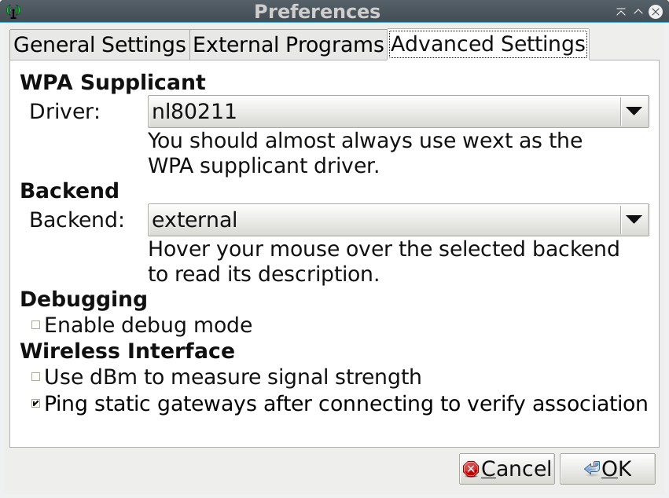

# Realtek 8822BU driver for Linux

Driver for 802.11ac USB Adapter with RTL8822BU chipset.

Currently, only STA/Monitor Mode is supported, no AP.

A few known wireless cards that use this driver include 
* [Edimax EW-7822ULC](http://us.edimax.com/edimax/merchandise/merchandise_detail/data/edimax/us/wireless_adapters_ac1200_dual-band/ew-7822ulc/)
* [ASUS AC-53 NANO](https://www.asus.com/Networking/USB-AC53-Nano/)
* [Linksys WUSB6400M](https://www.linksys.com/us/p/P-WUSB6400M/)

## Prerequisite

On Debian and Ubuntu, install packages via apt:

```
$ sudo apt install dpkg-dev
$ sudo apt install build-essential libc6-dev linux-headers-`dpkg-architecture -qDEB_HOST_ARCH`
```

On the other distros, please refer their build instruction for kernel modules (Because I don't know so much any other than Debian/Ubuntu). And it would be appriciated if you would tell me the way.


## Build and install.

Currently tested with Linux kernel 4.13.10 and 4.14.2 on X86_64 platform **only**.

To build, you have to retrieve source and run `make`.
If via Git, do following:

```sh
$ git clone https://github.com/FomalhautWeisszwerg/rtl8822bu.git
$ cd rtl8822bu
$ make
$ sudo make install
```

Or via tarball, do:

```sh
$ curl -LO https://github.com/FomalhautWeisszwerg/rtl8822bu/archive/release-for-linux-4.14.tar.gz
$ tar -xf release-for-linux-4.14.tar.gz
$ cd rtl8822bu-release-for-linux-4.14/
$ make
$ sudo make install
```

To Unload driver you may need to disconnect the device.


### NOTES

This driver allows use of wpa_supplicant by using the nl80211 driver
`wpa_supplicant -Dnl80211`. If you use "Wicd Network Manager", you can use this driver with the following screenshot settings.



If installing on Rasberry Pi or other "armv71" devices, edit the Makefile and set `CONFIG_PLATFORM_ARM_RPI = y` and `CONFIG_PLATFORM_I386_PC = n`


## Status

Driver basically works.
Most of the work is done is cleaning the driver and make this mess **readable**   for conversion.
Updates for wireless-ext/cfg80211  are not accepted.  


## Bugs

If you find something, please report on [GitHub issue](https://github.com/FomalhautWeisszwerg/rtl8822bu/issues).

Also Pull Requests are wellcome :-)
